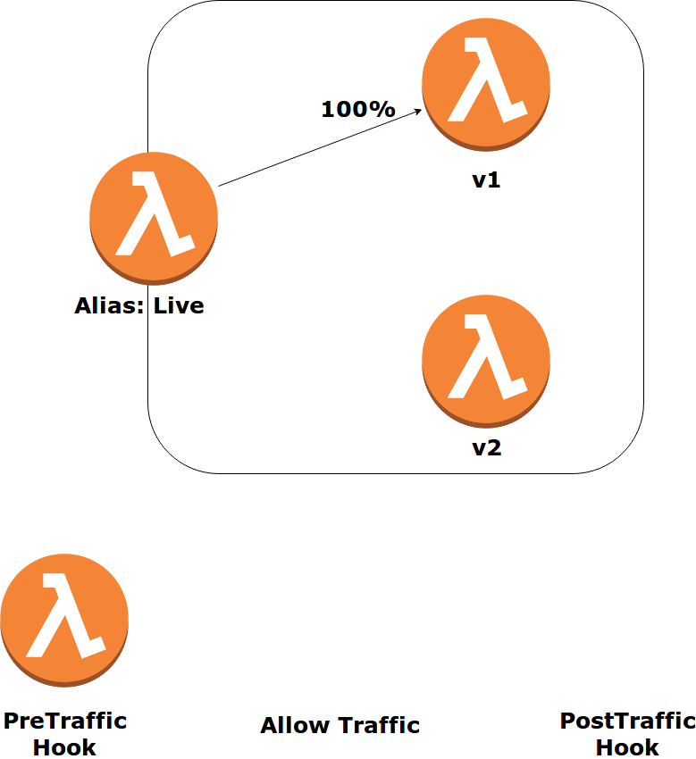

# Serverless Framework Meetup - Madrid
Monolitos… Entornos virtualizados… microservicios… ¿y ahora serverless? ¿Qué es? ¿Puedo trabajar con ello sin tener que poner una tarjeta de crédito? ¿Qué cambia en nuestra manera de trabajar?


Serverless es un tipo de arquitectura donde las máquinas dejan de existir y el código se ejecuta en ambientes suministrados por los distintos proveedores cloud.

Serverless Framework nos simplifica el desarrollo, orquestación y despliegue de los distintos elementos que conforman estas arquitecturas.


## Requisitos

### Nodejs
Recomendamos instalar node usando [nvm](https://github.com/creationix/nvm)

Para instalar la ultima version disponible

    nvm install node

Para instalar una versión específica

    nvm install 6.14.4 # or 10.10.0, 8.9.1

Para listar las versiones disponibles

    nvm ls-remote

Para usar una version especifica instalada

    nvm use 6.14.4 # or 10.10.0, 8.9.1

### Serverless framework

    npm install -g serverless

### Docker

Necesitamos tener instalados instalar [docker](https://docs.docker.com/install/) y 
[docker-compose](https://docs.docker.com/compose/install/)

### Python3

Instrucciones de instalacion para [Linux](https://docs.python-guide.org/starting/install3/linux/), 
[Windows](https://docs.python-guide.org/starting/install3/win/)
y [Mac OS X](https://docs.python-guide.org/starting/install3/osx/)

Es recomendable el uso de [venv](https://virtualenv.pypa.io/en/stable/)

Una vez instalado podemos activarlo de la siguiente manera:
```
virtualenv -p python3 env
source env/bin/activate
```
Las dependencias se pueden añadir a un archiro requeriments.txt
```
pip install -r requirements.txt
```

### AWS cli
Para poder desplegar necesitamos instalar aws cli

    pip install awscli --upgrade --user

Y para su configuracion

    aws configure

### GIT
Para poder descargarnos recursos vamos a utilizar [GIT](https://git-scm.com/book/en/v2/Getting-Started-Installing-Git)

## Primeros pasos

Vamos a crear un proyecto en una carpeta serverless-meetup
```
mkdir serverless-meetup
cd serverless-meetup
sls create --template aws-python3
```
Una vez creado podemos probar directamente la función creada
```
sls invoke local --function hello
```
También se pueden pasar un evento específico para realizar estas pruebas
```
sls invoke local --function hello --data {"name":world}
```
En serverless.yml se pueden añadir desencadenadores a la función. En este ejemplo añadimos uno de tipo http en la ruta hello (mediante un API Gateway que nos resulta transparente)
```
hello:
    handler: handler.hello

    <!-- Add this -->
    events:
        - http:
            path: hello
            method: any   
```

### Simulando en local
Serverless framework nos permite instalar múltiples plugins, vamos a utilizar uno para la ejecución offline
```
sls plugin install --name serverless-offline
```

Si lanzamos el siguiente comando podremos ver como levanta la lambda como servicio, exponiéndose en nuestro localhost en el puerto 3000
```
sls offline
```

Como no hemos especificado ningún verbo podemos hacer estas pruebas para comprobar el evento que recibimos en nuestra función.
```
curl localhost:3000/hello -X POST -d '{"name":"world"}'
```
o
```
curl localhost:3000/hello?name=world
```

## Añadir más servicios

Podemos crear un CRUD de usuarios añadiendo funciones en serverless.yml

Por ejemplo:
```
  get:
    handler: tasks.get_task
    events:
      - http:
          path: tasks/{id}
          method: get

  create:
    handler: tasks.create_task
    events:
      - http:
          path: tasks
          method: post
```
Puedes generar el fichero tasks a partir del hello creado como ejemplo. necesitarás las funciones create, list, get, update y delete.

## Despliegue
Teniendo AWS cli configurado el despliegue (y sus futuras actualizaciones) de nuestras funciones y su API Gateway es tan sencillo como hacer

    sls deploy

Podemos ir a la consola de Cloudformation de AWS y comprobar el stack que ha creado y todos sus recursos.

Igual que hemos invocado las lambdas en local podemos hacerlo de manera remota con

    sls invoke --function hello

Finalmente, para eliminar completamente el entorno desplegado basta con hacer

    sls remove

### Empaquetado

Se pueden excluir e incluir ficheros en el paquete que se genera para desplegar.
```
package:
#  include:
#    - include-me.py
#    - include-me-dir/**
  exclude:
    - '*.json'
    - 'init.sh'
    - 'Jenkinsfile'
    - '*.md'
    - 'images/**'
    - 'requeriments.txt'
    - 'env/**'
    - 'node_modules/**'
```

## Consumo de servicios de AWS
boto3 es la librería de python para el uso de servicios de AWS. Tendremos que usarla para poder hacer un API completamente funcional. 
Se puede utilizar para crear recursos en AWS como para instanciarlos para su uso.

Podemos instalarla con:

    pip install boto3

Y añadirla al fichero requeriments.txt


### DynamoDB
Lo primero que debemos hacer es instanciar el recurso que queremos utilizar 
```
# endpoint_url es opcional
dynamodb = boto3.resource('dynamodb', endpoint_url='http://localhost:4569')
    
table = dynamodb.Table(os.environ['DYNAMODB_TASKS_TABLE'])
```

Las distintas funciones que podemos llamar con table son:

    # Crear item
    table.put_item(Item=item)
    # Actualizar item
    table.update_item()
    # Recuperar item
    table.get_item(
      Key={
          'id': event['pathParameters']['id']
      }
    )
    # Listar todos los items
    table.scan()
    # Eliminar item
    table.delete_item(
      Key={
          'id': event['pathParameters']['id']
      }
    )

Para parsear la respuesta de DynamoDB a json necesitamos añadirle un codificador de decimales
```
json.dumps(result['Items'], cls=decimalencoder.DecimalEncoder)
```

Donde...
```
import decimal
import json

# This is a workaround for: http://bugs.python.org/issue16535
class DecimalEncoder(json.JSONEncoder):
    def default(self, obj):
        if isinstance(obj, decimal.Decimal):
            return int(obj)
        return super(DecimalEncoder, self).default(obj)
```

#### ADVERTENCIA

Una vez desplegado en el cloud, para poder acceder a servicios públicos, las lambdas deben estar en una vpc. Las Lambdas se despliegan por defecto sin una VPC asociada.

## Variables

Parte de la potencia de Serverless framework está en el uso de variables, que permite integrarlo con parámetros de la linea de comando, otras variables del mismo fichero, variables de ficheros externos (útil para tener ficheros de variables por entorno) e incluso atributos de recursos de cloudformation y outputs.

Las variables en provider.environment serán accesibles por las funciones lambda mediante el uso de os.environ['VAR_NAME']

```
custom:
    config:
      stage-default: local
      region-default: eu-west-1

provider:
  region: ${opt:region, self:custom.config.region-default}
  stage: ${opt:stage, self:custom.config.stage-default}
  environment:
    DYNAMODB_TASKS_TABLE: ${self:service}_${self:provider.stage}_Table
    STAGE: ${self:provider.stage}
```
Donde:
* opt -> parametro desde linea de comandos
* self -> propio fichero


También se pueden cargar desde fichero, lo que es muy util para tener configuraciones por entorno

  file: ${file(config/${self:provider.infraenv}.json)}

Y para poder acceder a las propiedades del fichero 

  ${self:custom.config.file:subnetId1}

## LocalStack
LocalStack es un proyecto open-source que permite simular los servicios de aws en local arrancando en contenedores docker.


### Instalación y arranque

```
git clone https://github.com/localstack/localstack.git
cd localstack
docker-compose up
```

### Creación de recursos

Se puede usar el aws cli para crear los recursos correspondientes en localstack.

[AWS cli with Localstack cheatsheet](https://lobster1234.github.io/2017/04/05/working-with-localstack-command-line/)

Crear Base de datos local
```
aws --endpoint-url=http://localhost:4569 dynamodb create-table --table-name serverless-meetup_local_Table  --attribute-definitions AttributeName=id,AttributeType=S --key-schema AttributeName=id,KeyType=HASH --provisioned-throughput ReadCapacityUnits=1,WriteCapacityUnits=1
```

## Creación de recursos

En serverless.yml se pueden añadir recursos de AWS para su creación como parte de la plataforma.

### Dynamodb

```
resources:
  Resources:
    Table:
      Type: 'AWS::DynamoDB::Table'
      Properties:
        AttributeDefinitions:
          -
            AttributeName: id
            AttributeType: S
        KeySchema:
          -
            AttributeName: id
            KeyType: HASH
        ProvisionedThroughput:
          ReadCapacityUnits: 1
          WriteCapacityUnits: 1
        TableName: ${self:provider.environment.DYNAMODB_TASKS_TABLE}
```


### Roles de acceso a recursos

Para que las funciones que creemos puedan acceder a los recursos se les debe dar los permisos necesarios de acceso. Se pueden utilizar las funciones de Cloudformation para recuperar los identificadores necesarios.
```
provider:
  iamRoleStatements:
    - Effect: Allow
      Action:
        - dynamodb:Query
        - dynamodb:Scan
        - dynamodb:GetItem
        - dynamodb:PutItem
        - dynamodb:UpdateItem
        - dynamodb:DeleteItem
      Resource: 
        - { "Fn::GetAtt": ["ServerlessDynamoDBTable", "Arn" ] }
```


## Testing unitario


```
import users
@patch.dict(os.environ, {'STAGE':'local','DYNAMODB_TASKS_TABLE':'serverless-meetup_local_Table'}, clear=True)
@patch('users.boto3')
def test_list(self, boto3):
    
    boto3.resource.return_value.Table.return_value.scan.return_value = {'Items':[]}
    
    result=listUser({},{})
    self.assertEqual(result['statusCode'], 200)
```

### Cobertura de código
```
coverage run tasks_test.py
coverage report
```  
## Despliegue avanzado

### Canary deployment

El canary deployment está inspirado en los mineros de carbón, que acudían a la mina con un canario, si el animalillo se desmayaba debían salir corriendo de la mina.


El mismo enfoque aplicamos a la hora de desplegar, primero desplegamos nuestra canary version y en caso de error redirigimos el tráfico a la versión segura y hacemos rollback.


Para hacer Canary deployments vamos a añadir un nuevo plugin

```
sls plugin install --name serverless-plugin-canary-deployments
```

Este plugin nos permite realizar un canary deployment de una manera tan facil como poner estos parámetros en la lambdas

```
deploymentSettings:
  type: Linear10PercentEvery1Minute
  alias: Live
```

Lo que conseguiremos con esto es que se despliegue una versión canary y que cada minuto se le aplique un 10% más de tráfico. Una vez que todo el tráfico está migrado se elimina la versión anterior.




#### Rollback

El canary deployment anterior es muy útil, sin embargo, tal y como está, está falto de lógica ya que en caso de fallo la instancia canary seguiría recibiendo tráfico.

Para poder hacer un seguimiento del comportamiento de la lambda canary y conseguir hacer un rollback vamos a instalar un nuevo plugin que nos facilitará la creación de alertas para monitorizar los errores.

```
sls plugin install --name serverless-plugin-aws-alerts
```

y para activarlo debemos añadir
```
custom:
  # Needed for serverless-plugin-aws-alerts
  alerts:
    dashboards: true
```
Con este plugin podemos añadir alertas a las lambdas. En este caso, ésta alerta se disparará cuando nuestra lambda canary de un error.

```
alarms:
  - name: Error
    namespace: 'AWS/Lambda'
    metric: Errors
    threshold: 1
    statistic: Maximum
    period: 60
    evaluationPeriods: 1
    comparisonOperator: GreaterThanOrEqualToThreshold
```

Podemos añadir las alarmas que consideremos al deployment. Cuando alguna de ella se dispare todo el tráfico se volvera a migrar a la versión anterior y el despliegue hará un rollback.

```
deploymentSettings:
  type: Linear10PercentEvery1Minute
  alias: Live
  alarms:
    - HelloErrorAlarm
```

El nombre de la alarma siempre será la concatenacion del nombre de la funcion con el nombre de la alarma seguido del la palabra Alarm en camel case (en este caso: hello+error+Alram = HelloErrorAlarm)

#### Testing "end to end"

También podemos añadir funciones a ejecutar antes de empezar a migrar el tráfico y cuando la migración ha terminado satisfactoriamente. Esto nos permite confirmar que nuestras lambdas son correctas antes de empezar a recibir tráfico y confirmar que tras el despligue todas las piezas están correctamente integradas.

Una vez más, si alguna de estas ejecuciones da fallo el trafico se vuelve a migrar a la versión actual.

```
  deploymentSettings:
    type: Linear10PercentEvery1Minute
    alias: Live
    preTrafficHook: preHook
    postTrafficHook: postHook
    alarms:
      - HelloErrorAlarm
preHook:
  handler: hooks.pre
postHook:
  handler: hooks.post
```

### Añadir Continuous Deployment 

Con un sencillo pipeline de jenkins podemos desplegar y actualizar nuestra arquitectura multi-branching.

```
pipeline {
    agent any

    stage ('Unit testing') {
          steps {
              script {
                  '''
                      coverage run test_users.py
                      coverage report
                  '''
              }
          }
      }
    stages {
        stage ('Deploy') {
            steps {
                script {
                    sh "sls deploy --stage $BRANCH_NAME"
                }
            }
        }
    }
}
```

## Conclusiones

## Autoría

* **[Ruben Gil](mailto:rgil@atsistemas.com)** - *Technical lead Solutions Architect* - 

## Fuentes de información

### Arquitecturas serverless
* https://enmilocalfunciona.io/tag/serverless/
* https://aws.amazon.com/es/serverless/
* https://read.acloud.guru/serverless/home

### Serverless en AWS
* https://aws.amazon.com/es/blogs/compute/applying-the-twelve-factor-app-methodology-to-serverless-applications/
* https://aws.amazon.com/es/premiumsupport/knowledge-center/internet-access-lambda-function/
* https://speakerdeck.com/alexcasalboni/advanced-serverless-architectural-patterns-on-aws

### Serverless Framework
* https://serverless.com/framework/docs/providers/aws/guide/intro/
* https://serverless.com/framework/docs/providers/aws/guide/variables/
* https://serverless.com/framework/docs/providers/aws/events/
* https://serverless.com/blog/aws-lambda-sqs-serverless-integration/
* https://serverless.com/blog/keep-your-lambdas-warm/

### Deployment strategies
* https://serverless.com/blog/manage-canary-deployments-lambda-functions-serverless-framework/
* https://hackernoon.com/canary-deployments-in-serverless-applications-b0f47fa9b409
* https://thenewstack.io/deployment-strategies/

### Localstack
* https://github.com/localstack/localstack
* https://lobster1234.github.io/2017/04/05/working-with-localstack-command-line/

### More than FaaS
* https://www.serverlessops.io/blog/static-websites-on-aws-s3-with-serverless-framework